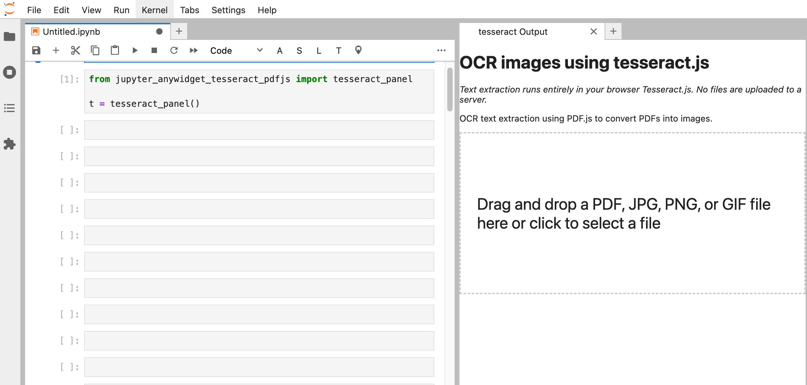

# jupyter_anywidget_tesseract_pdfjs

Tesseract./ pdf.js [`anywidget`](https://github.com/manzt/anywidget) for previewing PDF and extracting text from PDF, image, etc. in JupyterLab

Inspired by and building on @simonw's (Simon Willison) [OCR tool](https://github.com/simonw/tools/blob/main/ocr.html) [[about](https://simonwillison.net/2024/Mar/30/ocr-pdfs-images/)], use `tesseract.js` in a Jupyter notebook environment via an `anywidget` wrapper.

Using the `anywidget` framework, we can essentially load Javascript and WASM models into a sidebar widget and use the widget for "side-processing" using the browser machinery.

For example, we can use the [`tesseract.js`](https://tesseract.projectnaptha.com/) for OCR/text extraction on images, and [`pdf.js`](https://mozilla.github.io/pdf.js/) for converting PDF documents to images which can then be OCR'd using `tesseract.js`.

This reduces the number of Python dependencies that need to be installed on the host machine, albeit at the expense of loading resources into the browser.

*I'm not much a packaging expert, so some assets are likely to be loaded from a URI; ideally, everything would be bundled into the `anywidget` extension.*

## Installation

`pip install jupyter_anywidget_tesseract_pdfjs`

## Usage

Import the `jupyter_anywidget_tesseract_pdfjs` package and launch a widget:

```python
from jupyter_anywidget_tesseract_pdfjs import tesseract_panel

t = tesseract_panel()
```

This loads the widget by default into a new panel using [`jupyterlab_sidecar`](https://github.com/jupyter-widgets/jupyterlab-sidecar).

You can then drag and drop an image file or PDF file onto the landing area or load an image or path in from a notebook code cell.



